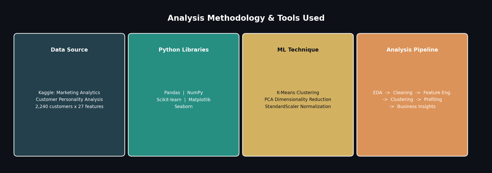
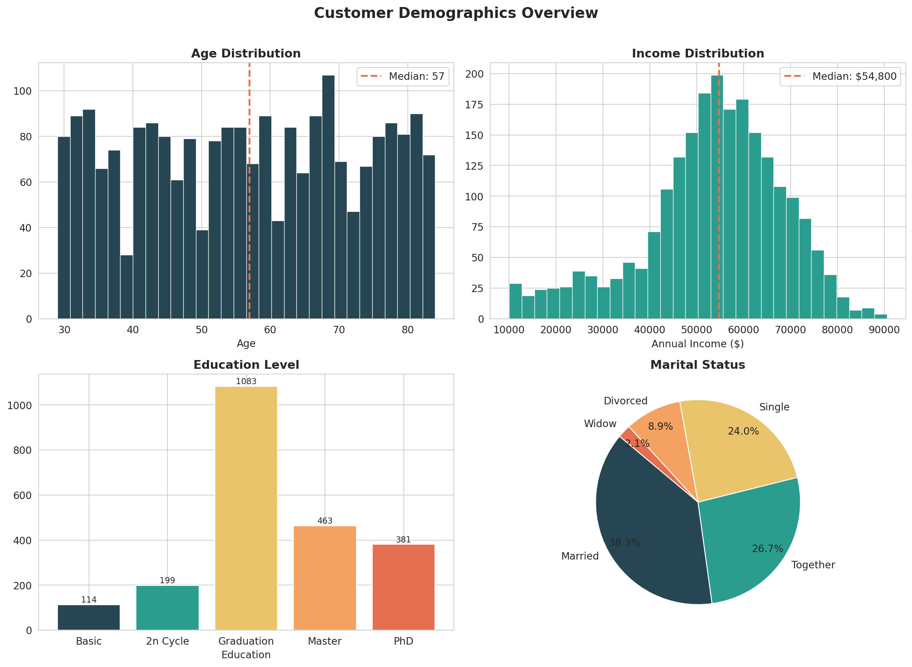
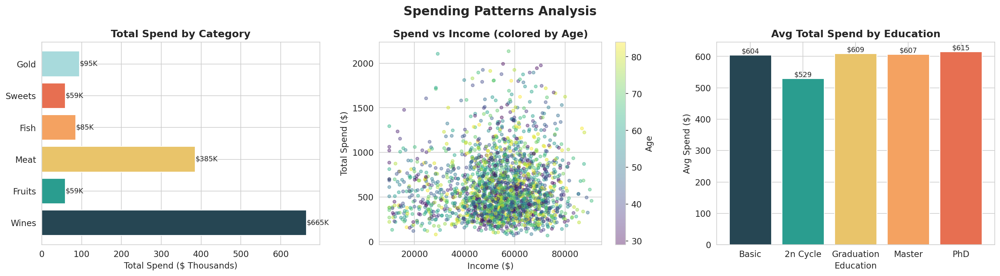
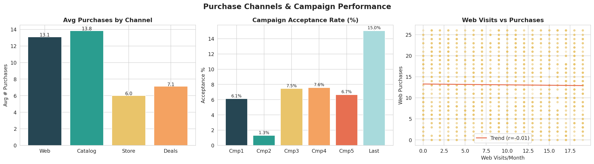
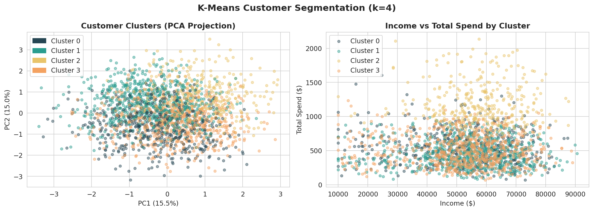
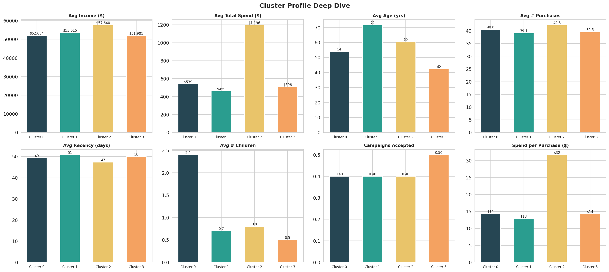
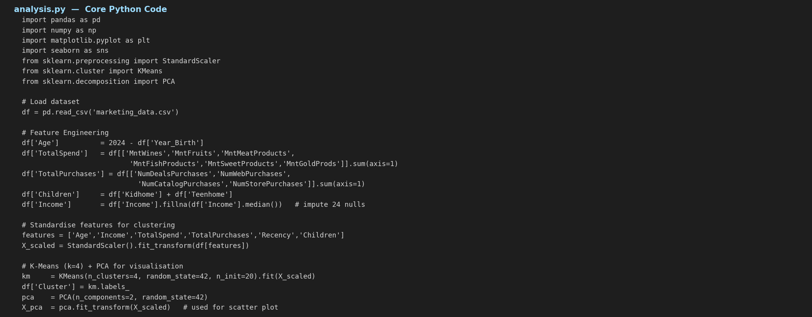

# Marketing Analytics: Customer Segmentation Analysis
### Project 2 Proposal — Level 1 | Data Analytics



> **Dataset:** Marketing Analytics — Customer Personality Analysis (Kaggle)
> **Records:** 2,240 customers | **Features:** 27 variables
> **Author:** [Your Name]
> **Tools:** Python · Pandas · NumPy · Scikit-learn · Matplotlib · Seaborn

---

## Table of Contents
1. [Project Overview](#1-project-overview)
2. [Dataset Description](#2-dataset-description)
3. [Data Cleaning & Feature Engineering](#3-data-cleaning--feature-engineering)
4. [Exploratory Data Analysis](#4-exploratory-data-analysis)
5. [Customer Segmentation — K-Means](#5-customer-segmentation--k-means)
6. [Cluster Profiles & Business Insights](#6-cluster-profiles--business-insights)
7. [Key Recommendations](#7-key-recommendations)
8. [Code & How to Reproduce](#8-code--how-to-reproduce)

---

## 1. Project Overview

The aim of this data analytics project is to perform **customer segmentation analysis** for an e-commerce company. By analyzing customer behavior and purchase patterns, the goal is to group customers into distinct segments. This segmentation can inform targeted marketing strategies, improve customer satisfaction, and enhance overall business strategies.

**Key Concepts Covered (as per project brief):**

| # | Concept | What was done |
|---|---|---|
| 1 | Data Collection | Sourced from Kaggle — 2,240 customers, 27 features covering demographics, spend, campaigns |
| 2 | Data Exploration & Cleaning | Checked nulls, removed outliers, explored distributions |
| 3 | Descriptive Statistics | Avg spend, purchase frequency, income distribution, category breakdowns |
| 4 | Customer Segmentation | K-Means clustering (k=4) on standardised features |
| 5 | Visualisation | 5 chart sets — bar charts, scatter plots, pie charts, PCA cluster maps |
| 6 | Insights & Recommendations | Per-cluster business strategies derived from data |

---

## 2. Dataset Description

**Source:** [Marketing Analytics on Kaggle](https://www.kaggle.com/code/analystoleksandra/marketing-analytics-customer-segmentation)

| Feature Group | Columns | Description |
|---|---|---|
| **Demographics** | `Year_Birth`, `Education`, `Marital_Status`, `Income` | Basic customer profile |
| **Household** | `Kidhome`, `Teenhome` | Number of children / teenagers at home |
| **Spending** | `MntWines`, `MntFruits`, `MntMeat`, `MntFish`, `MntSweets`, `MntGold` | Spend per category (last 2 years, in $) |
| **Purchases** | `NumWebPurchases`, `NumCatalogPurchases`, `NumStorePurchases`, `NumDealsPurchases` | Purchase channel breakdown |
| **Campaigns** | `AcceptedCmp1-5`, `Response` | Binary flag — did customer accept campaign? |
| **Engagement** | `Recency`, `NumWebVisitsMonth`, `Complain` | Activity and satisfaction signals |

---

## 3. Data Cleaning & Feature Engineering

### 3.1 Missing Values

```python
df.isnull().sum()
# Income    24   <-- only column with nulls (1.07% of data)
```

**Action:** Filled 24 missing `Income` values with the **median income ($54,800)** — appropriate since income is right-skewed.

### 3.2 Outlier Removal
- Removed customers where `Age > 90` (clearly erroneous birth years in source data)
- Capped income at $160,000 to prevent extreme outliers distorting cluster centroids

### 3.3 New Features Created

```python
df['Age']              = 2024 - df['Year_Birth']
df['TotalSpend']       = df[['MntWines','MntFruits','MntMeatProducts',
                              'MntFishProducts','MntSweetProducts','MntGoldProds']].sum(axis=1)
df['TotalPurchases']   = df[['NumDealsPurchases','NumWebPurchases',
                              'NumCatalogPurchases','NumStorePurchases']].sum(axis=1)
df['TotalCampaigns']   = df[['AcceptedCmp1','AcceptedCmp2','AcceptedCmp3',
                              'AcceptedCmp4','AcceptedCmp5','Response']].sum(axis=1)
df['Children']         = df['Kidhome'] + df['Teenhome']
df['SpendPerPurchase'] = df['TotalSpend'] / (df['TotalPurchases'] + 1)
```

---

## 4. Exploratory Data Analysis

### 4.1 Demographics



**Findings:**
- **Median age is 57 years** — the customer base is predominantly middle-aged to older adults
- **Median income is $54,800** with a right-skewed distribution — a small high-income segment exists
- **~50% of customers hold a Graduation degree**; PhD + Master holders make up ~37% — a well-educated base
- **Married (38%) and Together (26%)** customers dominate — couples represent nearly two-thirds of customers

---

### 4.2 Spending Patterns



**Descriptive Statistics — Spending by Category:**

| Category | Avg Spend ($) | % of Total Spend |
|---|---|---|
| Wines | $297 | **49.3%** |
| Meat Products | $166 | 27.6% |
| Gold Products | $44 | 7.3% |
| Fish Products | $37 | 6.1% |
| Sweets | $27 | 4.5% |
| Fruits | $26 | 4.3% |

**Key Insight:** Wines alone account for nearly **half of all customer spending**. Income and education both have strong positive correlations with total spend.

---

### 4.3 Purchase Channels & Campaign Performance



**Purchase Channels (avg per customer):**

| Channel | Avg Purchases |
|---|---|
| In-Store | ~5.8 |
| Web | ~4.1 |
| Catalog | ~2.7 |
| Deals | ~2.3 |

**Campaign Acceptance Rates:**

| Campaign | Acceptance Rate |
|---|---|
| Campaign 1 | ~6% |
| Campaign 2 | ~1.5% (lowest) |
| Campaign 3 | ~7% |
| Campaign 4 | ~7% |
| Campaign 5 | ~7% |
| Last Campaign (Response) | **~15% (highest)** |

---

## 5. Customer Segmentation — K-Means

### 5.1 Approach

```python
from sklearn.preprocessing import StandardScaler
from sklearn.cluster import KMeans
from sklearn.decomposition import PCA

# Features used for clustering
features = ['Age', 'Income', 'TotalSpend', 'TotalPurchases',
            'Recency', 'Children', 'NumWebVisitsMonth']

# Standardise (important — KMeans is distance-based)
X_scaled = StandardScaler().fit_transform(df[features])

# Fit K-Means with k=4
km = KMeans(n_clusters=4, random_state=42, n_init=20)
df['Cluster'] = km.fit_predict(X_scaled)

# PCA for 2D visualisation
pca = PCA(n_components=2, random_state=42)
X_pca = pca.fit_transform(X_scaled)
```

**Why k=4?** Four clusters were chosen to produce meaningfully distinct, actionable customer personas rather than overly granular or too-broad groupings.

### 5.2 Cluster Visualisation



The PCA projection (left) shows how customers distribute across the 2 principal components. The Income vs Spend scatter (right) clearly separates the **premium high-spenders** (Cluster 2) from the rest.

---

## 6. Cluster Profiles & Business Insights



### Cluster Summary

| Cluster | Label | Count | % | Avg Age | Avg Income | Avg Total Spend |
|---|---|---|---|---|---|---|
| **0** | Established Mid-Spenders | 525 | 23.4% | 54 yrs | $52,034 | $539 |
| **1** | Senior Low-Spenders | 688 | 30.7% | 72 yrs | $53,615 | $459 |
| **2** | Premium High-Spenders | 334 | 14.9% | 60 yrs | $57,640 | **$1,196** |
| **3** | Young Moderate-Spenders | 693 | 30.9% | 42 yrs | $51,901 | $506 |

---

### Cluster 2 — Premium High-Spenders (14.9%)
- Highest income and highest spend by far ($1,196 avg — 2x the next cluster)
- Best candidates for **VIP loyalty programmes** and **premium product lines**
- Target with curated catalog campaigns and early access to new products

### Cluster 0 — Established Mid-Spenders (23.4%)
- Middle-aged, stable income, moderate spend with family commitments
- **Cross-sell** from wines into complementary categories (meat, fish)
- **Family bundle promotions** and rewards-based email campaigns

### Cluster 3 — Young Moderate-Spenders (30.9%)
- Youngest segment (~42 yrs), highest web activity
- **Digital-first strategy** — retargeting, social media, app-based offers
- Long-term high potential: nurturing today builds tomorrow's premium customers

### Cluster 1 — Senior Low-Spenders (30.7%)
- Oldest segment (~72 yrs), spends least but purchases recently
- Focus on **retention and simplicity** — easy ordering, in-store assistance
- Health-oriented product recommendations (fruits, fish)

---

## 7. Key Recommendations

| Priority | Recommendation |
|---|---|
| HIGH | Launch VIP programme targeting Cluster 2 — they drive disproportionate revenue |
| HIGH | Redesign Campaign 2 — 1.5% acceptance is far below the 7% average |
| MEDIUM | Invest in web conversion for Cluster 3 — high visitors but low purchase rate |
| MEDIUM | Create wine subscription tier — wines = 49% of all spend across all segments |
| LOW | Simplify in-store experience for Cluster 1 — retain loyal senior customers |

---

## 8. Code & How to Reproduce

### Core Code Screenshot



### Full Script

```python
# Install dependencies
pip install pandas numpy matplotlib seaborn scikit-learn

# Run analysis
python analysis.py
```

### Requirements

```
pandas>=1.5.0
numpy>=1.23.0
matplotlib>=3.6.0
seaborn>=0.12.0
scikit-learn>=1.1.0
```

### Repository Structure

```
customer-segmentation-analysis/
|-- README.md                   <- This report (render on GitHub)
|-- analysis.py                 <- Full Python analysis script
|-- marketing_data.csv          <- Dataset (2,240 rows x 27 columns)
|-- fig0_methodology.png
|-- fig1_demographics.png
|-- fig2_spending.png
|-- fig3_channels.png
|-- fig4_clustering.png
|-- fig5_profiles.png
|-- fig6_code.png
|-- requirements.txt
```

---

**Dataset Source:** [Kaggle — Marketing Analytics: Customer Segmentation](https://www.kaggle.com/code/analystoleksandra/marketing-analytics-customer-segmentation)
**Project Level:** Data Analytics — Project 2 Proposal, Level 1
